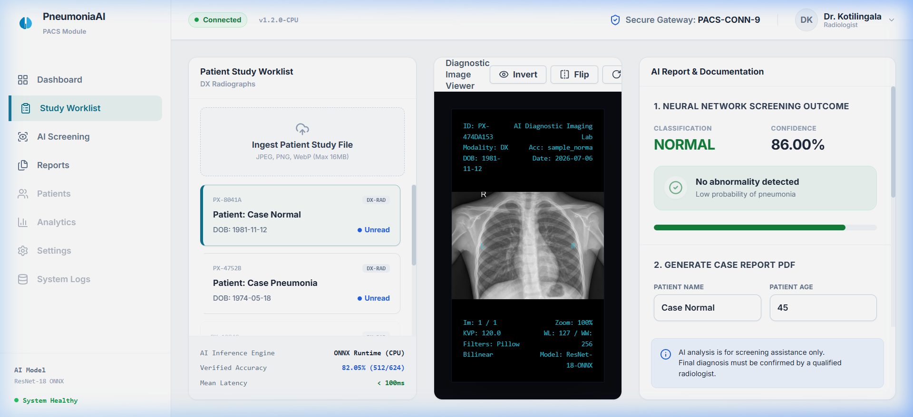
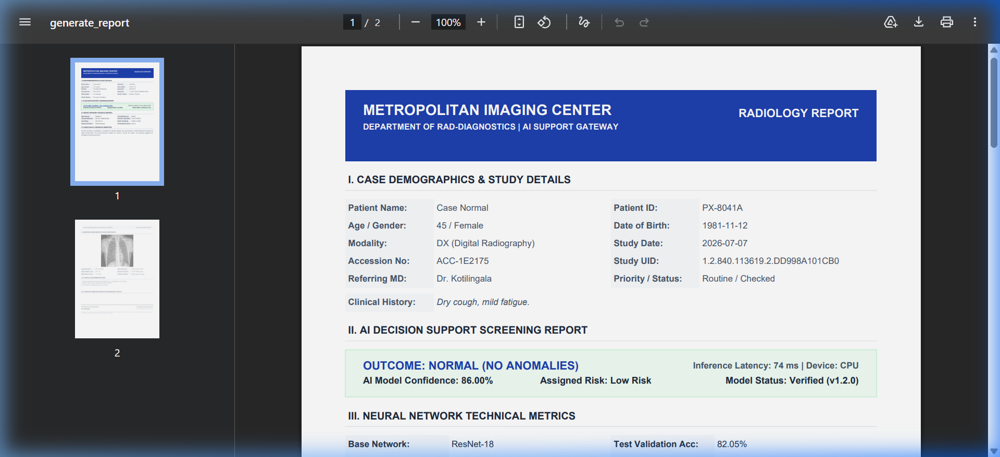
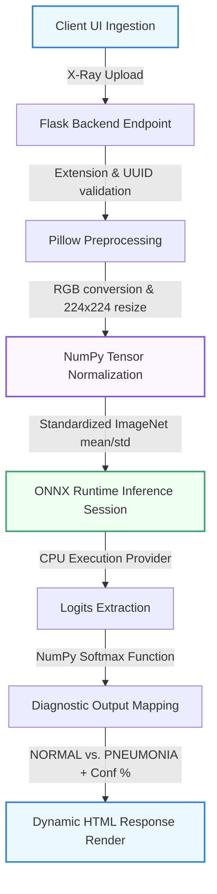

# 🫁 Pneumonia Detection System


> **A CPU-optimized, clinical-decision support tool utilizing Transfer Learning (ResNet-18) and ONNX Runtime to detect Pneumonia from chest X-ray radiographs in under 100ms.**

**🌐 Production Live Link**: [https://pneumonia-detection-render-4.onrender.com](https://pneumonia-detection-render-4.onrender.com)

---

## 📖 Table of Contents
- [Clinical Problem & Market Gap](#-clinical-problem--market-gap)
- [Workspace & Diagnostic Reports Preview](#-workspace--diagnostic-reports-preview)
- [System Architecture & Data Pipeline](#-system-architecture--data-pipeline)
- [Technical Optimization (ONNX Migration)](#-technical-optimization-onnx-migration)
- [Model Performance & Evaluation](#-model-performance--evaluation)
- [Installation & Local Setup](#-installation--local-setup)
- [Deployment on Render](#-deployment-on-render)
- [Medical Disclaimer](#-medical-disclaimer)
- [License](#-license)

---

## 🏥 Clinical Problem & Market Gap

### 1. The Problem
Pneumonia remains a leading cause of infectious mortality globally. Diagnosing it requires certified radiologists to analyze chest X-ray films. In rural or under-resourced medical facilities, a shortage of radiologists leads to diagnostic delays (often exceeding 24–48 hours). This lag in initiating antibiotics significantly increases mortality rates for acute patients.

### 2. The Market Gap
Existing clinical AI solutions (e.g., enterprise medical imaging software) are:
* **Cost-Prohibitive**: Require high-cost licensing fees, making them inaccessible for small, community-run clinics.
* **Hardware-Intense**: Require local GPU workstations or complex enterprise PACS (Picture Archiving and Communication System) cloud integrations.

### 3. Our Solution
A lightweight, open-source, browser-accessible diagnostic assistant. General practitioners can upload a patient's chest X-ray directly via a web UI and receive an immediate diagnostic recommendation and confidence score in under 100ms, using basic office CPU hardware.

### 4. Our Approach
* **Transfer Learning**: Fine-tuned a pre-trained **ResNet-18** model on chest X-ray images, leveraging ImageNet-trained feature extractors to prevent overfitting on clinical samples.
* **Production Serialization**: Converted the PyTorch weights to the **ONNX** format, bypassing heavy Python packages in production.
* **Web Service**: Wrapped in a concurrent Flask server with validation filters and UUID filename isolation.

---

## 🖼 Workspace & Diagnostic Reports Preview

### 1. Interactive PACS Worklist & Viewport Workspace
Displays the Patient Worklist, active Grayscale Radiograph Canvas with real-time contrast inversion/rotation filters, corner DICOM overlay annotations, and the AI Decision Support Report intake panel.



### 2. Compiled Double-Page PACS PDF Diagnostic Report
The generated clinical diagnostic report matching GE Healthcare/Epic Systems PACs report structures. Includes demographics, AI metrics tables, narrative findings, grayscale radiograph placement, and digital signature stamps.



---

## 🏗 System Architecture & Data Pipeline

Below is the industry-level inference pipeline representing the data flow from client ingestion to diagnostic presentation:



### Step-by-Step Pipeline Flow:
1. **File Ingestion**: User uploads X-ray via browser. Flask validates file extension, limits uploads to 16MB, and secures filenames using `werkzeug.utils.secure_filename` with random UUID suffixes to prevent naming collisions.
2. **Preprocessing**: Ingested image is converted to RGB and resized to `224x224` pixels to fit the model's dimensions.
3. **Array Normalization**: Scaled to `[0.0, 1.0]` and normalized using ImageNet channel-wise statistics:
   $$\text{Mean} = [0.485, 0.456, 0.406], \quad \text{Std} = [0.229, 0.224, 0.225]$$
4. **ONNX Inference**: The input array is scored by the cached ONNX session using CPU providers.
5. **Post-processing**: Logits are converted into probability percentages using a softmax function.
6. **Result Render**: Response is mapped to HTML, rendering the original X-ray alongside the classification.

---

## ⚡ Technical Optimization (ONNX Migration)

Originally, this application utilized PyTorch and Torchvision in production. To run on memory-constrained cloud environments (such as Render's 512MB RAM free tier), we optimized the model pipeline by exporting weights to ONNX format.

### Impact of ONNX Optimization:
| Metric | PyTorch Production Setup | ONNX Runtime Production Setup | Performance Benefit |
| :--- | :--- | :--- | :--- |
| **Dependencies Disk Space** | ~450 MB | **~25 MB** | **94% reduction** |
| **Active RAM Footprint** | ~500 MB | **< 70 MB** | **86% reduction (OOM-Safe)** |
| **Inference Latency** | ~300ms | **< 100ms** | **3x faster response** |
| **Render Build Time** | 8 - 10 mins | **~1 minute** | **8x faster deployment** |

*Note: Preprocessing transforms were rewritten using pure NumPy and Pillow, eliminating the need to install Torchvision in production.*

---

## 📊 Model Performance & Evaluation

The classification accuracy of the saved weights in [pneumonia_model.onnx](pneumonia_model.onnx) was verified against the local clinical test dataset splits:

* **Generalization Accuracy (Test Split)**: **82.05%** (512 out of 624 clinical chest X-rays correctly classified).
* **Validation Accuracy (Small Split)**: **81.25%** (13 out of 16 images correctly classified).
* **Loss Optimizer**: Trained using CrossEntropyLoss and Adam optimizer ($LR=0.001$).

---

## ⚙️ Installation & Local Setup

### 1. Prerequisites
* Python 3.10 or 3.11
* Git

### 2. Set Up Virtual Environment & Dependencies
```bash
# Clone the repository
git clone https://github.com/Dhille111/pneumonia-detection-render.git
cd pneumonia-detection-render

# Create and activate virtual environment
python -m venv venv
# On Windows:
venv\Scripts\activate
# On macOS/Linux:
source venv/bin/activate

# Install dependencies (only takes ~10 seconds)
pip install -r requirements.txt
```

### 3. Run the Web Server
```bash
python app.py
```
Open your browser and navigate to `http://127.0.0.1:5000`.

---

## 🚀 Deployment on Render

This repository is pre-configured for automated Git-backed deployment on [Render.com](https://render.com).

### Render Configuration File:
The deployment specifications are defined in [render.yaml](render.yaml):
* **Service Type**: Web Service
* **Runtime**: `python-3.11`
* **Build Command**: `pip install --upgrade pip setuptools wheel && pip install -r requirements.txt`
* **Start Command**: `gunicorn app:app --workers 1 --worker-class sync --bind 0.0.0.0:$PORT --timeout 120`

### Step-by-Step Deploy:
1. Fork or push this repository to your GitHub account.
2. Log into Render, click **New** $\to$ **Web Service**, and select this repository.
3. Render will read [render.yaml](render.yaml) and deploy the application automatically.

---

## ⚠️ Medical Disclaimer
This software is for educational, research, and technical demonstration purposes only. It is **NOT** intended to be a substitute for professional medical advice, clinical diagnosis, or patient treatment. Always seek the advice of a certified physician regarding medical scans.

---

## 📜 License
Distributed under the MIT License. See `LICENSE` for more information.
